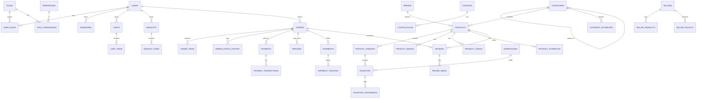

# Database Architecture & Schema Proposal

PostgreSQL 16. Conventions: `id` UUID PK (`gen_random_uuid()`), `created_at`/`updated_at`
timestamptz, `deleted_at` for soft-delete on user/content entities, all money as `numeric(12,2)`
(never float), currency `char(3)`, enums as Postgres native types or constrained text. All FKs
indexed. Names snake_case. This is the design; DDL is produced in Phase 1 after approval.

## 1. High-level ERD (logical)

## 2. Auth & Identity

| Table | Key columns | Notes / constraints |
|---|---|---|
| `users` | id, email(uniq, citext), phone(uniq, nullable), password_hash, name, status, email_verified_at, phone_verified_at, last_login_at, failed_login_count, locked_until, loyalty_points | soft-delete; partial unique on active email/phone |
| `roles` | id, code(uniq), name, is_system | e.g. SUPER_ADMIN, SELLER |
| `permissions` | id, code(uniq), resource, action, description | e.g. catalog.product.create |
| `user_roles` | user_id, role_id, granted_by, granted_at | PK(user_id, role_id), scope (nullable seller_id) |
| `role_permissions` | role_id, permission_id | PK(role_id, permission_id) |
| `sessions` | id, user_id, refresh_token_hash(uniq), user_agent, ip, expires_at, revoked_at | refresh rotation |
| `otp_tokens` | id, destination, channel, code_hash, purpose, expires_at, consumed_at, attempts | rate-limited |
| `password_resets` | id, user_id, token_hash, expires_at, used_at | |
| `api_keys` | id, user_id/actor, key_hash, scopes, last_used_at, revoked_at | future/machine access |

## 3. Customer & Address

| Table | Key columns |
|---|---|
| `addresses` | id, user_id, label, full_name, phone, line1, line2, landmark, city, state, country, pincode, is_default_shipping, is_default_billing, deleted_at |
| `wishlists` | id, user_id, name, is_default |
| `wishlist_items` | id, wishlist_id, product_variant_id, notify_price_drop, notify_back_in_stock, added_at | unique(wishlist_id, product_variant_id) |
| `recently_viewed` | user_id/anon_id, product_id, viewed_at | |

## 4. Catalog

| Table | Key columns | Notes |
|---|---|---|
| `categories` | id, parent_id, name, slug(uniq), path/materialized_path, level, image_url, description, seo_title/description/keywords, position, is_active, deleted_at | hierarchy; `path` for fast subtree queries |
| `category_attributes` | id, category_id, attribute_id, is_required, is_filterable, position, inherit_to_children | which attrs apply |
| `attributes` | id, code, name, data_type(enum: text/number/bool/select/multiselect/color), unit, is_variant_axis, is_filterable | dynamic system — no hard-coded filters |
| `attribute_values` | id, attribute_id, value, slug, meta(JSONB) | select options / colors |
| `brands` | id, name, slug(uniq), logo_url, description, seo, is_active |
| `products` | id, sku(uniq base), name, slug(uniq), short_description, description, brand_id, category_id, seller_id(nullable→merchant), status(draft/pending/active/out_of_stock/archived/disabled), tax_class_id, mrp, selling_price, currency, weight_g, length_mm/width_mm/height_mm, warranty_text, return_eligible, shipping_class, seo_title/description/keywords, rating_avg(numeric 3,2), rating_count, sales_count, is_featured, published_at, deleted_at | price on product = default; variant overrides |
| `product_variants` | id, product_id, sku(uniq), name, price, mrp, tax_class_id, weight_g, dims, barcode, position, is_active, image_id | variant-level everything |
| `variant_attribute_values` | variant_id, attribute_id, attribute_value_id, raw_value | maps variant axes |
| `product_images` | id, product_id, variant_id(nullable), url, alt, width, height, position, is_primary | |
| `product_videos` | id, product_id, url, thumbnail_url, position | |
| `product_attributes` | product_id, attribute_id, attribute_value_id, value_text/value_number | non-variant specs |
| `product_relations` | product_id, related_product_id, relation_type(similar/fbt/accessory), position | recommender seeds |
| `collections` | id, name, slug, type(manual/auto), rules(JSONB), is_active, seo | curated pages |
| `collection_products` | collection_id, product_id, position | |

## 5. Inventory

| Table | Key columns | Notes |
|---|---|---|
| `warehouses` | id, name, code(uniq), address, pincode, is_active, priority | |
| `inventory` | id, warehouse_id, product_variant_id, quantity, reserved_quantity, damaged_quantity, returned_quantity, low_stock_threshold, updated_at | unique(warehouse_id, variant_id); **available = quantity - reserved**; row-locked in checkout |
| `inventory_movements` | id, inventory_id, type(purchase/sale/reserve/release/adjust/damage/return/transfer), quantity_delta, reason, reference_type/reference_id, actor_id, created_at | append-only audit |

## 6. Cart & Checkout

| Table | Key columns |
|---|---|
| `carts` | id, user_id(nullable→guest), anon_id, status(active/converted/abandoned), currency, coupon_code, updated_at, expires_at |
| `cart_items` | id, cart_id, product_variant_id, quantity, unit_price_snapshot, added_at, save_for_later(bool) | unique(cart_id, variant_id) |
| `checkout_sessions` | id, cart_id, address_id, delivery_option, payment_intent_id, idempotency_key(uniq), totals_json, status, expires_at |

## 7. Orders

| Table | Key columns | Notes |
|---|---|---|
| `orders` | id, order_number(uniq human), user_id(nullable guest), email, phone, status(enum full lifecycle), currency, subtotal, discount_total, tax_total, shipping_total, grand_total, coupon_code, shipping_address_json, billing_address_json, placed_at, cancelled_at, notes, idempotency_key(uniq) | |
| `order_items` | id, order_id, product_id, variant_id, seller_id, name_snapshot, sku_snapshot, quantity, unit_price, mrp, discount, tax_rate, tax_amount, line_total, status, return_eligible_until | price snapshots immutable |
| `order_status_history` | id, order_id, from_status, to_status, changed_by, reason, created_at | append-only |
| `order_notes` | id, order_id, author_id, note, is_internal | support notes |

Order lifecycle enum: `PLACED, PAYMENT_PENDING, CONFIRMED, PROCESSING, PACKED, SHIPPED,
OUT_FOR_DELIVERY, DELIVERED, CANCELLED, PAYMENT_FAILED, RETURN_REQUESTED, RETURN_APPROVED,
PICKUP_SCHEDULED, RETURNED, REFUND_PENDING, REFUNDED`. Every transition writes `order_status_history`.

## 8. Payments & Finance

| Table | Key columns | Notes |
|---|---|---|
| `payments` | id, order_id, provider, method(upi/card/netbanking/wallet/cod/emi/link), amount, currency, status(created/authorized/captured/failed/refunded/partially_refunded), provider_payment_id, provider_order_id, idempotency_key(uniq), raw_response(JSONB), created_at | never store card data |
| `payment_transactions` | id, payment_id, type(authorize/capture/void/refund/chargeback), amount, status, provider_txn_id(uniq), signature_verified, payload(JSONB), created_at | idempotent by provider_txn_id |
| `webhook_events` | id, provider, event_id(uniq per provider), type, payload(JSONB), signature_verified, processed_at, attempts | dedupe + replay |
| `refunds` | id, order_id, payment_id, amount, reason, type(full/partial/store_credit), status, provider_refund_id, approved_by, created_at, completed_at | |
| `invoices` | id, order_id, invoice_number(uniq), gst_details(JSONB), pdf_url, issued_at | India GST-ready |
| `seller_payouts` *(future)* | id, seller_id, period_start/end, gross, commission, deductions, net, status, paid_at | |
| `settlements` *(future)* | id, seller_id, payout_id, order_id, amount | traceability |

## 9. Shipping & Logistics

| Table | Key columns |
|---|---|
| `shipping_zones` | id, name, countries/states/pincode_ranges(JSONB), is_active |
| `shipping_methods` | id, zone_id, name, provider, rate_type(flat/weight/free), base_rate, per_kg_rate, free_above, eta_min_days, eta_max_days, cutoff_time |
| `serviceability` | pincode, provider, is_cod, is_prepaid, eta_days, updated_at | cached pincode checks |
| `shipments` | id, order_id, seller_id(nullable), warehouse_id, provider, awb_number(uniq), status, tracking_url, label_url, weight_g, shipped_at, delivered_at, rto_at |
| `shipment_tracking` | id, shipment_id, status, location, description, event_time, raw(JSONB) |
| `delivery_estimates` | cache/record of pincode+warehouse→eta used at checkout |

## 10. Promotions

| Table | Key columns |
|---|---|
| `coupons` | id, code(uniq), description, type(percentage/fixed/free_shipping/bxgy/category/product/brand/first_order), value, min_order_value, max_discount, start_at, end_at, usage_limit, per_user_limit, used_count, is_active, customer_id(nullable) |
| `coupon_rules` | id, coupon_id, rule_type(eligible_product/eligible_category/excluded_product/excluded_category/eligible_brand/customer_segment), reference_id |
| `coupon_redemptions` | id, coupon_id, user_id, order_id, discount_amount, redeemed_at | unique(coupon_id, order_id) |
| `promotions` | id, name, type, config(JSONB), start_at, end_at, is_active, priority |
| `campaigns` | id, name, channel, config(JSONB), metrics(JSONB), start/end |

## 11. Reviews, Notifications, Support

| Table | Key columns |
|---|---|
| `reviews` | id, product_id, order_id, user_id, rating(1-5), title, body, is_verified_purchase, status(pending/approved/rejected), helpful_count, seller_id, seller_response, created_at |
| `review_media` | id, review_id, url, type(image/video) |
| `review_votes` | review_id, user_id, vote(helpful/report) | unique per user |
| `notifications` | id, user_id, type, title, body, data(JSONB), channel, read_at, created_at |
| `notification_templates` | id, code(uniq), channel, subject, body, variables(JSONB) |
| `support_tickets` | id, ticket_number, user_id, order_id, subject, status, priority, assigned_to, sla_due_at, created_at |
| `ticket_messages` | id, ticket_id, author_id, body, is_internal, created_at |
| `faqs` | id, question, answer, category, position, is_active |
| `cms_pages` | id, slug(uniq), title, content, seo, status, published_at |
| `homepage_sections` | id, type, config(JSONB), position, is_active, start/end |

## 12. Marketplace (future-ready, present in schema)

| Table | Key columns |
|---|---|
| `sellers` | id, user_id(uniq), store_name, slug(uniq), logo, banner, commission_rate, kyc_status, gst_number, pan, bank_details(encrypted), status, rating_avg |
| `seller_products` | id, seller_id, product_id, seller_sku, price, status, commission_rate_override |
| `seller_kyc` | id, seller_id, doc_type, doc_url, verified, verified_by, verified_at |
| `payout_schedules` | id, seller_id, cadence, next_run_at |

## 13. Analytics, Audit, System

| Table | Key columns |
|---|---|
| `audit_logs` | id, actor_id, actor_type, action, resource_type, resource_id, old_value(JSONB), new_value(JSONB), ip, user_agent, created_at | immutable |
| `analytics_events` | id, event_name, user_id/anon_id, session_id, properties(JSONB), created_at | partitioned by month later |
| `search_queries` | id, user_id/anon_id, query, result_count, clicked_product_id, added_to_cart, purchased, created_at |
| `jobs` / `job_failures` | BullMQ state mirrored for reporting; DLQ records |
| `settings` | key(uniq), value(JSONB), updated_by |
| `feature_flags` | key, enabled, rules(JSONB) |

## 14. Indexing & Performance Plan

- FKs indexed; composite indexes on hot filters: `products(category_id, status, selling_price)`,
  `products(brand_id, status)`, `product_variants(product_id)`, `inventory(product_variant_id)`,
  `orders(user_id, placed_at desc)`, `orders(status, placed_at)`, `order_items(order_id)`,
  `payments(order_id)`, `reviews(product_id, status)`.
- GIN index on `products` tsvector (name+description+tags) and on JSONB attrs used in filters.
- `pg_trgm` GIN for fuzzy/typo search on product name/brand.
- Partition large append-only tables (`analytics_events`, `inventory_movements`,
  `order_status_history`) by month at scale via declarative partitioning.
- All list endpoints paginate (keyset pagination for large sets); avoid N+1 by design.

## 15. Integrity & Concurrency Rules

- Inventory: reservation uses `UPDATE inventory SET reserved_quantity = reserved_quantity + $1
  WHERE product_variant_id=$2 AND (quantity - reserved_quantity) >= $1` and checks affected rows —
  race-safe without oversell. Releases on cart expiry / failed payment.
- Coupons: `used_count` incremented in same transaction as order creation with row lock; per-user
  redemption unique constraint prevents double-use.
- Payments/webhooks: unique provider ids make replays no-ops.
- All state machines (order, payment, shipment, return) reject illegal transitions in the service
  layer, with history append.

## 16. Migrations, Backup, DR

- Prisma Migrate (or SQL migrations) versioned in repo; forward-only, reviewed; destructive
  migrations require explicit approval + backup first.
- Automated daily full backup + PITR (managed Postgres); 30-day retention MVP.
- RPO ≤ 1h (point-in-time), RTO ≤ 4h MVP; documented restore runbook and quarterly restore test.